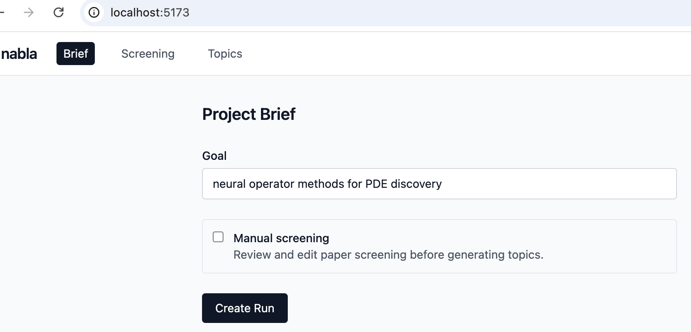
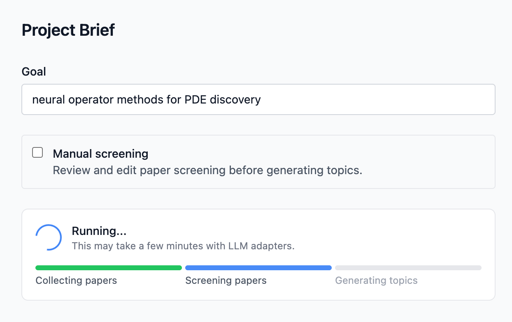
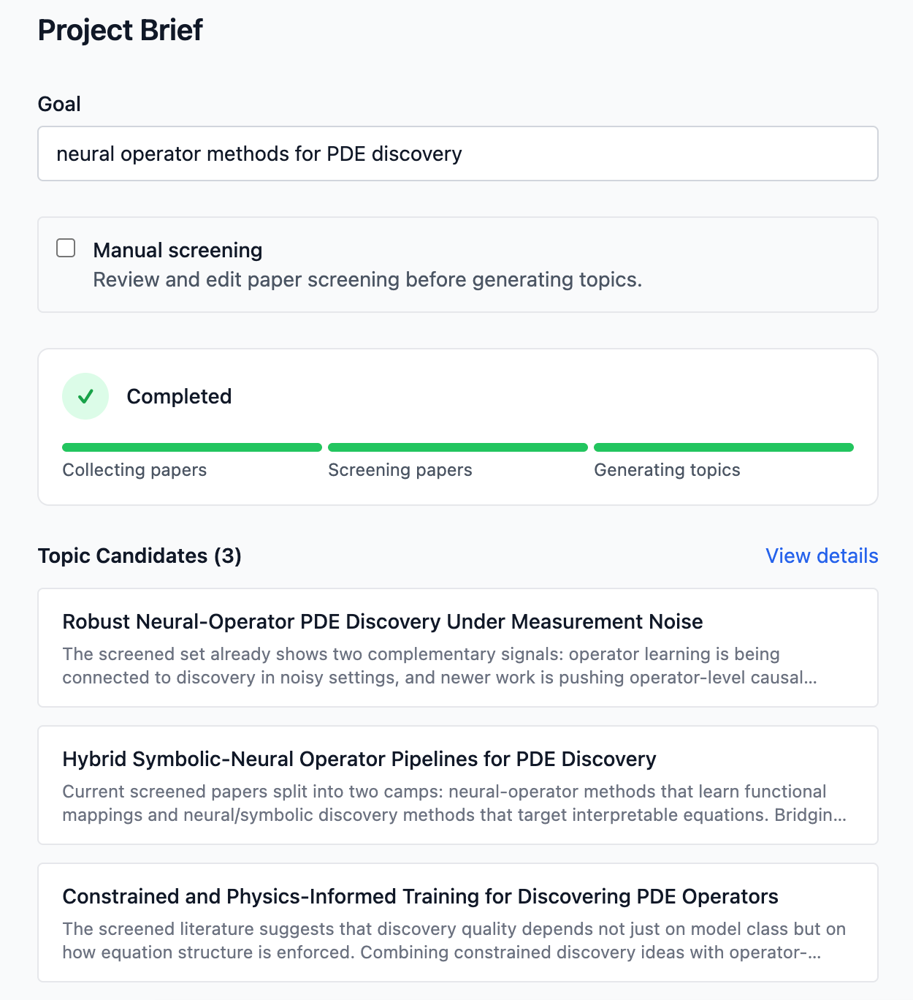

# Nabla

科研选题 Agent — 从模糊兴趣到结构化候选方向。

## 它做什么

输入一句研究兴趣，自动完成：论文检索 → AI 筛选 → 方向提炼，输出 2-3 个候选选题方向，附代表论文引用和风险评估。

## 架构

```
┌──────────┐  ┌──────────┐  ┌──────────┐
│   CLI    │  │   axum   │  │  Tauri   │  ← 薄交互层
└────┬─────┘  └────┬─────┘  └────┬─────┘
     └─────────────┼──────────────┘
                   ▼
     ┌───────────────────────────┐
     │    TopicAgentService      │  ← 全部业务逻辑
     ├───────────────────────────┤
     │  create_run()             │
     │  update_screening_decision() │
     │  rerun_propose()          │
     └───┬────────┬────────┬────┘
         │        │        │
     storage  collector  adapter(可插拔)
```

**技术栈**：Rust（8 crate）+ React/TypeScript

**LLM 后端**：Claude CLI / Codex CLI / Anthropic API / OpenAI API（可插拔）

**数据源**：OpenAlex + arXiv

## 运行示例

```bash
cargo run -p nabla-cli -- --brief examples/sample_brief.json --adapter test
```

### Web UI

输入研究兴趣，一键启动：



系统自动执行 Collecting → Screening → Generating 工作流：



完成后输出候选选题方向（以下为某次真实运行，非固定输出）：



每个方向包含 why-now、scope、risk、fallback，并附代表论文引用，便于用户回看生成依据。

## 状态

- **M1 完成**：CLI 全流程，累计 20 次真实运行
- **M2 完成**：axum HTTP API + React Web UI（Brief / Papers / Screening / Topics 四个页面）
- **M2.2 计划中**：评估系统
- **M3 计划中**：Tauri 桌面应用